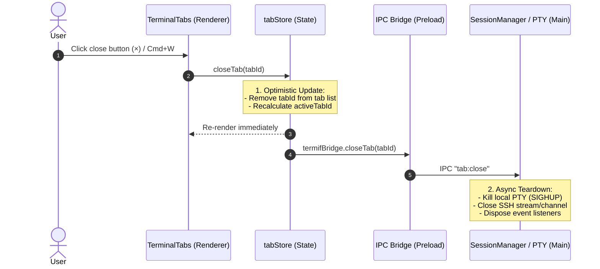

# Design Spec: Optimistic Tab Teardown & Resource Cleanup

Date: 2026-08-30
Status: Approved

## 1. Context & Problem Statement
Currently in termif, attempting to close a session tab (via UI close button `×` or shortcut `Cmd+W`/`Ctrl+W`) fails or gets blocked because the UI waits for a synchronous or event-driven IPC response from backend process cleanup, or because of unhandled state transitions when tearing down active sessions.

## 2. Goals & Non-Goals
### Goals
- **Instant UI Response (Zero-latency):** Closing a tab immediately removes it from the UI tab bar and switches active focus to the adjacent tab.
- **Reliable Async Teardown:** Local PTY processes and SSH channels are terminated cleanly in the background without blocking the UI renderer.
- **Edge-Case Resilience:** Closing the active tab, middle tab, or last remaining tab is handled smoothly.

### Non-Goals
- Adding complex prompt dialogues on tab close unless background tasks are actively unkillable.

## 3. Technical Architecture

### 3.1. Data Flow

### 3.2. State Management (`tabStore`)
- When `closeTab(tabId)` is triggered:
  1. Calculate replacement active tab:
     - If closing the currently active tab: select next tab index (right), or previous (left) if last index.
     - If all tabs closed: open a fresh default tab or return to empty studio state.
  2. Filter `tabId` out of `tabs` array.
  3. Dispose Xterm.js instance and attached listeners to release renderer memory.
  4. Call non-blocking IPC `termifBridge.closeTab(tabId)` wrapped in error catch.

### 3.3. Main Process / Backend Teardown (`SessionManager`)
- Handle `tab:close`:
  - Locate `TabSession` by `tabId`.
  - Send `SIGHUP`/`SIGTERM` to local PTY or close SSH shell channel.
  - Clean up session maps and release file descriptors.

## 4. Verification & Testing
- **Unit Tests:**
  - `tabStore.test.ts`: Verify instant state update, active tab shifting, and closing the last tab.
  - `SessionManager.test.ts`: Verify `closeTab` calls kill PTY and remove session cleanly.
- **Manual QA:**
  - Rapidly closing multiple tabs under SSH latency to confirm UI never locks.
